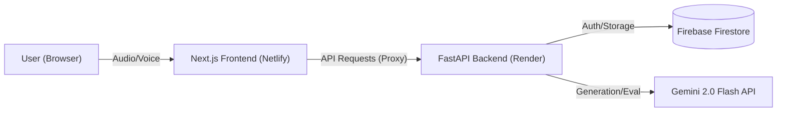

# AI Mock Interview
**Event:** UpSkill India Challenge – Techfest IIT Bombay 2025

**Team:** Fantastic Four

 

This project is an **AI Mock Interview Platform** designed to help job candidates, prepare for realistic interviews.

### What the Project Does

The platform offers a fully automated, voice-enabled interview experience that is powered by the **Gemini 2.5 Flash API** and a **FastAPI** backend.

* **Real-time Interaction:** Users speak their answers, which are immediately transcribed using multimodal Speech-to-Text (STT) capabilities.
* **Context-Aware Questioning:** The AI acts as a "Bar Raiser" interviewer. It uses the conversation history to ask dynamic follow-up questions, digging deeper on vague answers or advancing the topic if the candidate answers well.
* **Customization:** The interview is tailored based on the user's input for the **Job Role, Key Skills/Job Description, and Difficulty Level** (Easy, Medium, or Hard).

### Who It's For

The primary audience for this project is:

1.  **Job Candidates:** Individuals preparing for jobs who need to practice articulating technical concepts out loud.
2.  **Students/Recent Graduates:** Those lacking professional interview experience who need objective, metric-based feedback before entering the job market.

The platform provides a structured **0-100 score** report on **Technical Accuracy, Communication Clarity, and Fluency**, offering objective metrics that traditional mock interviews often lack.

## Setup Instructions
### Prerequisites
* **Node.js** (v18+)
* **Python** (v3.9+)
* **Google Gemini API Key** (Get it from Google AI Studio)
* **Firebase Service Account Credentials** (JSON file)

1. **Clone the repository**:
```bash
git clone https://github.com/genix2600/AI-Mock-Interview.git
cd AI-Mock-Interview
```

2. **Backend Setup (FastAPI)**:
```bash
cd backend
# Create virtual environment
python -m venv venv
source venv/bin/activate  #On Windows: venv\Scripts\activate

# Install dependencies (requires requirements.txt in backend/)
pip install -r requirements.txt

# Configure Environment Variables
# Create a .env file in the backend root and add:
# GEMINI_API_KEY=your_gemini_key
# FIREBASE_CREDENTIALS_JSON={"type": "service_account", ...} (Full JSON string)
```

3. **Frontend Setup (Next.js)**:
```bash
cd ../frontend
# Install dependencies
npm install

# Configure Environment Variables
# Create a .env.local file in the frontend root and add:
# NEXT_PUBLIC_API_BASE_URL=http://127.0.0.1:8000/
```

##  Architecture Overview

The system follows a decoupled **microservices architecture** to ensure scalability and separation of concerns.



## How to run locally

1. **Start the Backend Server**:
You need to start the Python server first. This allows the frontend to communicate with your local API endpoints and the Gemini service.

```bash
# Navigate to the backend/ directory
uvicorn src.main:app --reload --port 8000
# The API will be available at http://127.0.0.1:8000
```
The --reload flag is included to automatically restart the server when you make changes to your Python code.

2. **Start the Frontend Client**:
Once the backend is running, start the Next.js development server.

```bash
# Navigate to the frontend/ directory
npm run dev
# The application will be live at http://localhost:3000
```
Your application will open in your browser, and the proxy configuration will automatically route API calls to the local backend address (Port 8000).
## API Endpoints

### 1. Health Check
* **Endpoint:** `GET /health`
* **Description:** Verifies that the backend and AI services are operational.
* **Response:** `{"status": "healthy"}`

### 2. Generate Question
* **Endpoint:** `POST /interview/generate_question`
* **Description:** Generates the next question based on conversation history, custom job parameters, and difficulty level.
* **Input Example:**
    ```json
    {
      "session_id": "550e8400-e29b-41d4-a716-446655440000",
      "role": "Data Analyst",
      "difficulty": "Hard",
      "job_description": "Must know SQL window functions, Python pandas, and A/B testing concepts.",
      "user_answer": "I would use a CTE to simplify the query logic for better readability."
    }
    ```
* **Output Example:**
    ```json
    {
      "session_id": "550e8400-e29b-41d4-a716-446655440000",
      "ai_question": "That works for readability, but how does a CTE compare to a temp table in terms of performance optimization in a large dataset?",
      "is_complete": false
    }
    ```

### 3. Transcribe Audio
* **Endpoint:** `POST /interview/transcribe`
* **Description:** Converts Base64 encoded audio to text using Gemini Multimodal capabilities and extracts audio features (WPM, filler rate).
* **Input Example:**
    ```json
    {
      "session_id": "550e8400-e29b-41d4-a716-446655440000",
      "audio_data_uri": "data:audio/webm;base64,GkXfo59ChoEBQ..."
    }
    ```
* **Output Example:**
    ```json
    {
      "transcript": "I would use a CTE to simplify the query logic...",
      "duration_sec": 4.5,
      "audio_features": {
          "speechRateWpm": 130,
          "fillerRate": 0.05
      }
    }
    ```

### 4. Evaluate Interview
* **Endpoint:** `POST /interview/evaluate`
* **Description:** Generates a final structured score and feedback report (0-100 scale) based on the full session history and custom job scope.
* **Input Example:**
    ```json
    {
      "session_id": "550e8400-e29b-41d4-a716-446655440000",
      "role": "Data Analyst",
      "difficulty": "Hard",
      "job_description": "Must know SQL window functions, Python pandas, and A/B testing concepts."
    }
    ```
* **Output Example:**
    ```json
    {
      "technical_score": 85,
      "clarity_score": 90,
      "fluency_score": 88,
      "detailed_feedback": "The candidate demonstrated strong understanding of SQL optimization...",
      "technical_strengths": ["Query Optimization", "Database Design"],
      "technical_weaknesses": ["NoSQL concepts"],
      "final_verdict": "Strong Hire"
    }
    ```
## Dependencies

### Backend (Python)
* `fastapi` - Web framework
* `uvicorn` - ASGI server
* `google-genai` - Gemini API client
* `firebase-admin` - Database interaction
* `python-dotenv` - Environment management
* `pydantic` - Data validation

### Frontend (TypeScript)
* `next` - React framework
* `react` - UI library
* `tailwindcss` - Styling
* `lucide-react` - Icons
* `framer-motion` - Animations

---

## Contributors (Fantastic Four)

| Name | Role |
| :--- | :--- |
| **Aaryaman Vaidya** | Team Lead & Full Stack Architect |
| **Abhav Jain** | Backend Developer |
| **Annem Saad** | AI Research & Frontend Developer |
| **Ritam Sarkar** | Documentation & Testing / User Experience |

---

© 2025 Fantastic Four. Built for UpSkill India Challenge.


